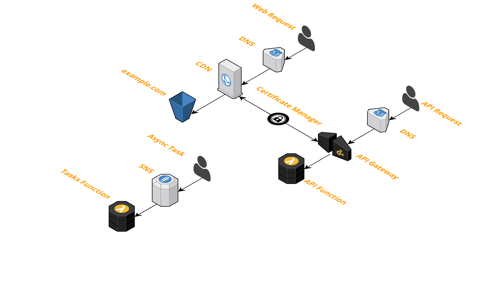

# CIM's Serverless Stack
This stack is completely serverless and powered by <a href="https://github.com/thestackshack/cim">CIM</a>.

It consists of:
* UI - Static S3 Website, CloudFront, SSL
* API - API Gateway, Lambda, SSL
* Async Tasks - SNS, Lambda

# Setup
## Prerequisites 
- Register your domain with Route53
- Or point your existing domain to Route53
- Configure 'admin@yourdomain.com' to receive the SSL verification email
  - You will have to confirm this email address.  This is annoying and I've asked AWS to remove this step if the domain is used with Route53.
  
## Stack Up
- Replace 'example.com' in `ui/_cim.yml` and `api/_cim.yml` with your domain name.
- Run `cim stack-up --recursive=true`

## CI/CD
CI/CD is available for the `ui`.  When enabled all commits to GitHub will trigger CodePipeline to build, test, and deploy your site.

## dev stage
You can also deploy a dev environment for testing.

`cim stack-up --recursive=true --stage=dev`
